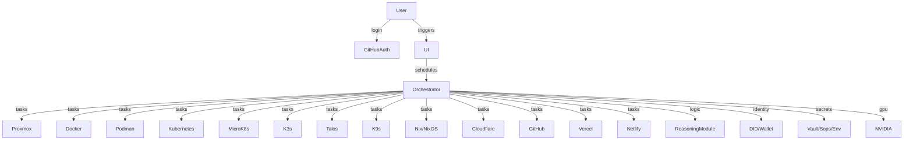

# Final Ultra-Innovative FOSS Agentic Orchestration Plan

This consolidated plan merges all previous architecture documents into a single, sequential, actionable strategy for building an ultra-compatible, agentic, FOSS developer platform.

---

## 1. Authentication & Secrets Management

- **GitHub OAuth:** FOSS libraries (e.g., goth) for login and agent permissions.
- **Secrets Storage:** 
  - Store Proxmox, API, and cloud credentials in environment variables or encrypted local files.
  - Support HashiCorp Vault, sops, or Kubernetes secrets for advanced setups.
  - Never log or expose secrets in UI.

---

## 2. Container, VM, and Cluster Integration

- **Proxmox:** Terraform provider and API integration for VM/container orchestration.
- **Docker & Podman:** Full support for Compose, Swarm, Podman CLI/API, rootless containers.
- **Kubernetes Family:**
  - **Kubernetes (k8s):** Upstream, MicroK8s, and K3s (lightweight, edge, and cloud clusters).
  - **Talos:** Immutable, API-driven Kubernetes OS; agentic tools for Talosctl and cluster management.
  - **K9s:** Integrate with K9s for terminal-based cluster management and monitoring.
- **Nix/NixOS:** Declarative infra, reproducible builds, agentic tools for Nix/NixOS management.

---

## 3. GPU & Hardware Acceleration

- **NVIDIA GPU:** Detection, passthrough, CUDA/ROCm support, agentic GPU workload management.

---

## 4. Multi-Cloud & Free-Tier Connectors

- **Cloudflare, GitHub, Vercel, Netlify:** Agentic orchestration for DNS, deployments, CI/CD, and serverless.
- **Secrets Management:** Env vars, encrypted files, Vault, sops, Kubernetes secrets, UI for credentials.

---

## 5. Reasoning, DePIN, and Cypherpunk Features

- **Classical Reasoning:** Prolog, Z3, symbolic logic libraries as agentic tools.
- **DePIN:** DID, wallet auth, peer-to-peer agent collaboration.
- **Privacy:** End-to-end encryption, verifiable logs, user privacy controls.

---

## 6. Agentic Orchestration Layer

- **Task Scheduling:** Unified queue/worker system for background and interactive jobs.
- **Agent Registry:** Register agents for LLM, infra, cloud, and logic tasks.
- **Backend Selection:** Agents choose best backend (local/cloud) based on policy, cost, and resource availability.
- **Hybrid Workflows:** Enable chaining of tasks across local and cloud resources.

---

## 7. UI/UX

- **Dashboard:** Status, logs, secrets, backend management, cluster visualization.
- **User Controls:** Platform selection, privacy, orchestration policy, credential management.

---

## Mermaid Diagram

---

## Sequential Implementation Steps

1. Implement FOSS GitHub OAuth and secrets management.
2. Build agentic connectors for Proxmox, Docker, Podman, Kubernetes (k8s, MicroK8s, K3s), Talos, and K9s.
3. Integrate Nix/NixOS support for reproducible infra.
4. Add GPU detection and management for agentic workloads.
5. Develop connectors for Cloudflare, GitHub, Vercel, Netlify (free tier).
6. Integrate classical reasoning, DePIN, and privacy modules.
7. Build the agentic orchestration layer (task scheduling, registry, backend selection).
8. Create the UI dashboard and user controls.
9. Test hybrid agentic workflows across all supported platforms, clusters, and hardware.

---

## Next Steps

- Use this file as the single source of truth for implementation.
- Delete superseded architecture files to avoid confusion.
- Proceed with sequential implementation as outlined above.
