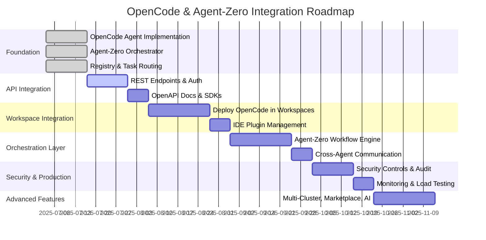
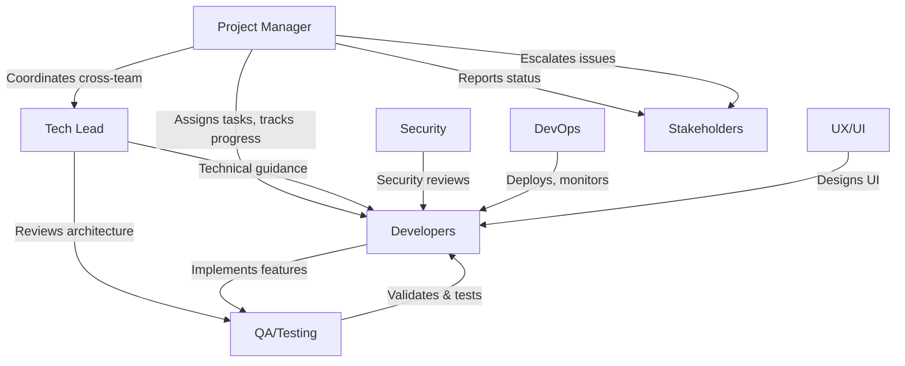

# Master Implementation Execution Plan: OpenCode & Agent-Zero Integration with Coder

## 1. Executive Summary

This master plan orchestrates the integration of OpenCode (AI agent platform) and Agent-Zero (orchestration framework) into Coder, leveraging modular agentic architecture to deliver advanced, secure, and scalable AI-powered IDE features. The plan aligns all workstreams—architecture, project management, QA/testing, and deployment—into a unified, actionable roadmap. Success is defined by seamless agent integration, robust orchestration, measurable productivity gains, and enterprise-grade security.

**Key Objectives:**
- Seamless integration of OpenCode and Agent-Zero with Coder’s agentic platform.
- Delivery of AI-powered IDE features and meta-orchestration.
- Secure, scalable, and auditable deployment.
- Measurable improvements in developer productivity and platform reliability.

**Success Criteria:**
- All integration phases completed on schedule.
- All agents pass validation and security gates.
- KPIs for performance, adoption, and reliability met or exceeded.

---

## 2. Implementation Roadmap

**Phases, Milestones, Dependencies, and Critical Path**

**Critical Path:**
- Foundation → API Integration → Workspace Integration → Orchestration Layer → Security & Production

**Dependencies:**
- Registry & Task Routing must precede API and workspace integration.
- Security controls must be in place before production rollout.

---

## 3. Resource Coordination Matrix

**Team Roles, Responsibilities, and Communication**

**Responsibility Assignment (RACI):**

| Workstream         | PM | TL | Dev | QA | Sec | Ops | UX | Stake |
|--------------------|----|----|-----|----|-----|-----|----|-------|
| Planning           | A  | C  | I   | I  | I   | I   | I  | C     |
| Architecture       | C  | A  | R   | C  | C   | C   | C  | I     |
| Implementation     | C  | C  | A   | C  | C   | C   | C  | I     |
| Testing/QA         | C  | C  | C   | A  | C   | I   | I  | I     |
| Security           | C  | C  | C   | C  | A   | C   | I  | I     |
| Deployment         | C  | C  | C   | C  | C   | A   | I  | I     |
| UX/UI              | C  | C  | C   | C  | I   | I   | A  | I     |
| Stakeholder Mgmt   | A  | I  | I   | I  | I   | I   | I  | R     |

- **A**: Accountable, **R**: Responsible, **C**: Consulted, **I**: Informed

**Communication Protocols:**
- Weekly cross-functional standups
- Bi-weekly stakeholder reviews
- Slack for daily coordination, Confluence for documentation
- Decision log maintained by PM

---

## 4. Success Metrics & KPIs

| Phase                | KPI/Metric                        | Target/Threshold                | Measurement Methodology         |
|----------------------|-----------------------------------|---------------------------------|---------------------------------|
| Foundation           | Agent interface compliance        | 100% unit test pass             | Automated test suite            |
| API Integration      | Endpoint coverage                 | 100% documented/tested          | OpenAPI + integration tests     |
| Workspace Integration| Workspace deployment success rate | >99%                            | CI/CD logs, error rates         |
| Orchestration Layer  | Workflow execution latency        | <2s per step                    | Prometheus metrics, tracing     |
| Security & Prod      | Security audit pass rate          | 100% critical issues resolved   | Audit reports, penetration test |
| Advanced Features    | Feature adoption rate             | >50% of target users            | Usage analytics                 |
| Overall              | Uptime (SLA)                      | 99.9%                           | Monitoring dashboards           |
|                      | Stakeholder satisfaction          | >90% positive survey response   | Stakeholder surveys             |

- **Quality Gates:** All phases require passing automated and manual QA, security review, and stakeholder sign-off.

---

## 5. Integration Validation Plan

- **End-to-End Validation Procedures:**
  - Full regression and integration test suite execution
  - Manual exploratory testing of IDE and orchestration features
  - Security and compliance validation

- **Acceptance Criteria:**
  - All critical workflows pass functional, security, and performance tests
  - Documentation and user guides complete
  - Stakeholder sign-off

- **Go-Live Readiness Checklist:**
  - All phases marked complete in project tracker
  - Monitoring and alerting configured
  - Rollback plan in place

- **Success Validation Protocols:**
  - Post-launch monitoring of KPIs
  - 2-week hypercare period with daily status reviews
  - Retrospective and lessons learned session

---

## 6. Risk Mitigation Execution

- **Prioritized Risk Response Plans:**
  - Technical: Fallback to previous agent versions, feature flags for rollout
  - Security: Immediate patching, incident response playbooks
  - Resource: Cross-training, backup assignments

- **Contingency Activation Triggers:**
  - Missed milestone by >1 week
  - Critical bug or security incident
  - KPI deviation >10% from target

- **Risk Monitoring Dashboards:**
  - Real-time project status (Jira/Asana)
  - Automated alerts for schedule, quality, and security risks

---

## 7. Stakeholder Communication Plan

- **Communication Schedules:**
  - Weekly status updates (email/Slack)
  - Bi-weekly demos and reviews
  - Monthly executive briefings

- **Reporting Formats:**
  - Dashboard snapshots
  - Executive summaries
  - Risk and issue logs

- **Escalation Procedures:**
  - Immediate escalation to PM and TL for blockers
  - Critical issues escalated to executive sponsor

- **Engagement Strategies:**
  - Early stakeholder involvement in design reviews
  - Feedback loops after each phase
  - Transparent decision-making and documentation

---

## 8. Master Project Charter

- **Project Authorization:**
  This plan formally authorizes the OpenCode & Agent-Zero integration with Coder, with the PM and TL accountable for delivery.

- **Scope Boundaries:**
  Integration of OpenCode and Agent-Zero into Coder’s agentic platform, including all supporting infrastructure, APIs, and security controls. Excludes unrelated platform features.

- **Success Criteria:**
  All phases completed, KPIs met, security and compliance validated, stakeholder sign-off.

- **Governance Structure:**
  - Project Board: PM, TL, Security, QA, Stakeholder reps
  - Change control via documented RFC process
  - Regular governance meetings

- **Project Closure Criteria:**
  - All deliverables accepted and documented
  - Knowledge transfer and training complete
  - Post-mortem and lessons learned archived
