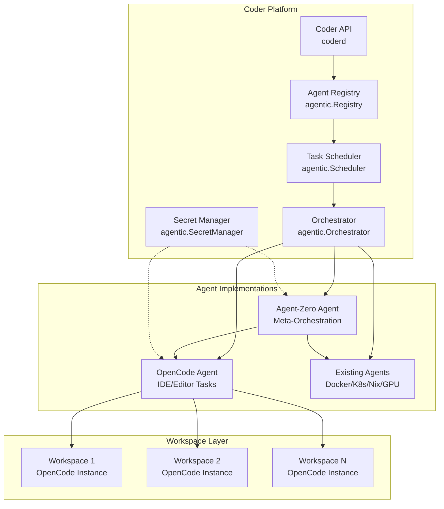
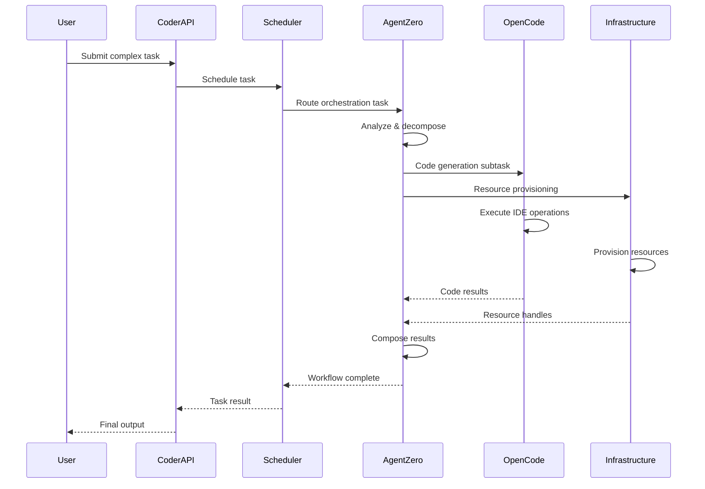
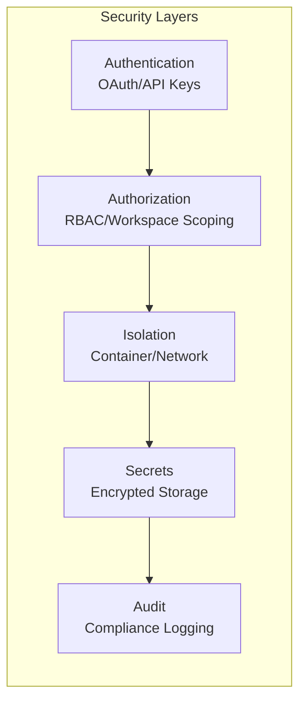

# OpenCode & Agent-Zero Integration Strategy for Coder

## Executive Summary

This document outlines a comprehensive integration strategy for incorporating OpenCode (AI agent platform for IDEs) and Agent-Zero (agent orchestration framework) into Coder's existing agentic architecture. The strategy leverages Coder's modular design, agent registry, and task scheduling system to create a seamless integration that enhances developer productivity through AI-powered IDE features and sophisticated agent orchestration.

## Table of Contents

1. [Integration Architecture](#1-integration-architecture)
2. [Deployment Models](#2-deployment-models)
3. [API Integration Points](#3-api-integration-points)
4. [Workflow Orchestration](#4-workflow-orchestration)
5. [Security & Isolation](#5-security--isolation)
6. [Implementation Phases](#6-implementation-phases)
7. [Technical Considerations](#7-technical-considerations)

---

## 1. Integration Architecture

### Core Design Principles

- **Agent Interface Compliance**: Both OpenCode and Agent-Zero must implement Coder's `Agent` interface with `Name()`, `Supports()`, and `Execute()` methods
- **Registry Pattern**: Leverage the existing `Registry` for agent discovery and task routing
- **Task-Based Architecture**: All operations flow through the `Task` and `TaskResult` structures
- **Orchestrator Integration**: Agent-Zero extends the `Orchestrator` pattern for complex workflows

### Architecture Overview



### Component Responsibilities

- **OpenCode Agent**: Handles IDE integration, code generation, plugin management, and editor-specific AI tasks
- **Agent-Zero Agent**: Provides meta-orchestration, workflow composition, and cross-agent coordination
- **Coder Platform**: Manages authentication, authorization, task scheduling, and resource allocation

---

## 2. Deployment Models

### Deployment Options

| Model | Architecture | Use Case | Implementation |
|-------|--------------|----------|----------------|
| **Workspace-Embedded** | OpenCode runs inside each workspace container | IDE/editor integration, user-specific configs | Deploy as sidecar container or process |
| **Platform-Service** | Agent-Zero runs as platform service | Cross-workspace orchestration, resource optimization | Deploy as Kubernetes deployment/service |
| **Hybrid-Optimized** | OpenCode per workspace, shared Agent-Zero pool | Balance isolation with resource efficiency | OpenCode in workspace, Agent-Zero in control plane |

### Recommended Approach: Hybrid-Optimized

The hybrid model provides the best balance of:
- **Isolation**: Each workspace gets its own OpenCode instance
- **Efficiency**: Shared Agent-Zero pool reduces resource overhead
- **Scalability**: Independent scaling of IDE and orchestration components
- **Security**: Clear boundary between user and platform resources

---

## 3. API Integration Points

### New API Endpoints

#### OpenCode Endpoints
```
POST   /api/v2/agents/opencode/register
GET    /api/v2/agents/opencode/plugins
POST   /api/v2/agents/opencode/tasks
GET    /api/v2/agents/opencode/tasks/{taskID}
```

#### Agent-Zero Endpoints
```
POST   /api/v2/agents/agentzero/workflows
GET    /api/v2/agents/agentzero/workflows/{workflowID}
POST   /api/v2/agents/agentzero/compose
GET    /api/v2/agents/agentzero/agents
```

#### Shared Agent Endpoints
```
GET    /api/v2/agents/registry
POST   /api/v2/agents/execute
GET    /api/v2/agents/status/{agentName}
```

### Integration with Existing Systems

- **Authentication**: Use `apiKeyMiddleware` for all agent endpoints
- **Authorization**: Leverage `HTTPAuthorizer` with workspace/org scoping
- **Audit**: Integrate with `Auditor` for compliance tracking
- **Rate Limiting**: Apply `apiRateLimiter` to prevent abuse

### API Request/Response Examples

#### Execute OpenCode Task
```json
POST /api/v2/agents/opencode/tasks
{
  "type": "opencode",
  "payload": {
    "action": "generate_code",
    "language": "go",
    "prompt": "Create a REST API endpoint for user management",
    "context": {
      "workspace_id": "ws-123",
      "file_path": "api/users.go"
    }
  }
}
```

#### Create Agent-Zero Workflow
```json
POST /api/v2/agents/agentzero/workflows
{
  "name": "Full Stack Feature",
  "steps": [
    {
      "id": "backend",
      "agent": "opencode",
      "task": "generate_api"
    },
    {
      "id": "frontend",
      "agent": "opencode",
      "task": "generate_ui",
      "depends_on": ["backend"]
    },
    {
      "id": "deploy",
      "agent": "kubernetes",
      "task": "apply_manifest",
      "depends_on": ["backend", "frontend"]
    }
  ]
}
```

---

## 4. Workflow Orchestration

### Task Flow Architecture



### Orchestration Capabilities

1. **Task Decomposition**: Break complex requests into atomic operations
2. **Dependency Management**: Handle task dependencies and parallel execution
3. **State Management**: Maintain workflow state across agent invocations
4. **Error Handling**: Implement retry logic and fallback strategies
5. **Result Composition**: Aggregate outputs from multiple agents

### Integration Points

- **Task Types**: Register new task types for `opencode` and `agentzero` operations
- **Workflow Steps**: Extend `WorkflowStep` for agent-specific parameters
- **Result Aggregation**: Use `WorkflowResult` for complex outputs
- **Event Streaming**: WebSocket support for real-time progress updates

---

## 5. Security & Isolation

### Multi-Layer Security Model



### Implementation Details

#### Workspace Isolation
- OpenCode runs with workspace user privileges
- Network policies restrict cross-workspace communication
- Resource quotas prevent noisy neighbor issues
- Separate namespaces for multi-tenancy

#### Secret Management
- Leverage `SecretManager` for API keys
- Per-workspace secret namespacing
- Rotation policies for long-lived credentials
- Encrypted storage with AES-256-GCM

#### Audit Trail
- All agent operations logged via `Auditor`
- Task execution history with input/output capture
- Compliance-ready audit format
- Retention policies configurable per organization

#### Access Control
- Fine-grained permissions for agent operations
- Workspace-scoped agent access
- Organization-level agent management
- Role-based access control (RBAC)

---

## 6. Implementation Phases

### Phase 1: Foundation (2-3 weeks)
- [ ] Implement OpenCode agent conforming to `Agent` interface
- [ ] Implement Agent-Zero agent with orchestration capabilities
- [ ] Register both agents in `Registry`
- [ ] Add basic task routing and execution
- [ ] Unit tests and integration tests

### Phase 2: API Integration (2-3 weeks)
- [ ] Add REST endpoints to `coderd`
- [ ] Implement authentication/authorization middleware
- [ ] Create OpenAPI documentation
- [ ] Add integration tests
- [ ] Client SDK updates

### Phase 3: Workspace Integration (3-4 weeks)
- [ ] Deploy OpenCode in workspace containers
- [ ] Implement workspace-agent communication protocol
- [ ] Add IDE plugin discovery and management
- [ ] Enable hot-reload for development
- [ ] Performance optimization

### Phase 4: Orchestration Layer (3-4 weeks)
- [ ] Extend `Orchestrator` for Agent-Zero
- [ ] Implement workflow composition engine
- [ ] Add dependency resolution for complex workflows
- [ ] Enable cross-agent communication
- [ ] Workflow templates and examples

### Phase 5: Security & Production (2-3 weeks)
- [ ] Implement comprehensive security controls
- [ ] Add monitoring and observability
- [ ] Performance optimization and load testing
- [ ] Documentation and deployment guides
- [ ] Security audit and penetration testing

### Phase 6: Advanced Features (Ongoing)
- [ ] Multi-cluster agent deployment
- [ ] Advanced workflow templates
- [ ] AI-powered task optimization
- [ ] Plugin marketplace integration
- [ ] Community contributions

---

## 7. Technical Considerations

### Performance Optimization

#### Connection Pooling
- Reuse agent connections via `TailnetCoordinator`
- Implement connection health checks
- Graceful connection recycling

#### Task Batching
- Group related tasks for efficiency
- Implement batch size limits
- Priority-based task scheduling

#### Caching Strategy
- Cache plugin metadata and agent capabilities
- Implement TTL-based cache invalidation
- Distributed cache for multi-replica deployments

### Monitoring & Observability

#### Metrics
- Export agent metrics to `PrometheusRegistry`
- Track task execution times, success rates
- Monitor resource utilization per agent

#### Tracing
- Integrate with `TracerProvider`
- Distributed tracing across agent calls
- Correlation IDs for request tracking

#### Logging
- Structured logging via `Logger`
- Log aggregation and analysis
- Alert rules for critical errors

### Scalability Patterns

#### Horizontal Scaling
- Agent-Zero instances behind load balancer
- Stateless agent design for easy scaling
- Auto-scaling based on queue depth

#### Queue Management
- Use `Scheduler` queue sizing
- Implement backpressure mechanisms
- Dead letter queues for failed tasks

#### Resource Limits
- Per-workspace agent quotas
- CPU/memory limits per agent type
- Rate limiting per user/organization

### Disaster Recovery

#### Backup Strategy
- Regular backups of workflow definitions
- Agent configuration snapshots
- Point-in-time recovery capabilities

#### High Availability
- Multi-region deployment options
- Automatic failover mechanisms
- Health checks and circuit breakers

### Migration Path

#### Existing Users
- Backward compatibility with current APIs
- Gradual rollout with feature flags
- Migration tools for existing workflows

#### Data Migration
- Export/import tools for workflows
- Version control integration
- Rollback capabilities

---

## Conclusion

This integration strategy provides a comprehensive approach to incorporating OpenCode and Agent-Zero into Coder's platform. By leveraging existing architectural patterns and focusing on modularity, security, and scalability, the integration will enhance Coder's capabilities while maintaining its core values of simplicity and developer productivity.

The phased implementation approach ensures manageable milestones with clear deliverables, while the technical considerations address real-world production requirements. This strategy positions Coder to deliver advanced AI-powered development experiences while maintaining enterprise-grade security and reliability.
